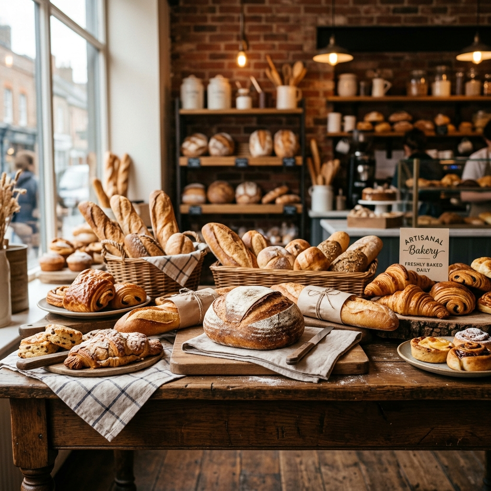
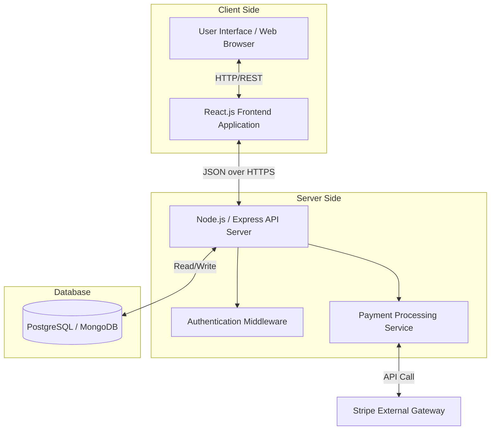
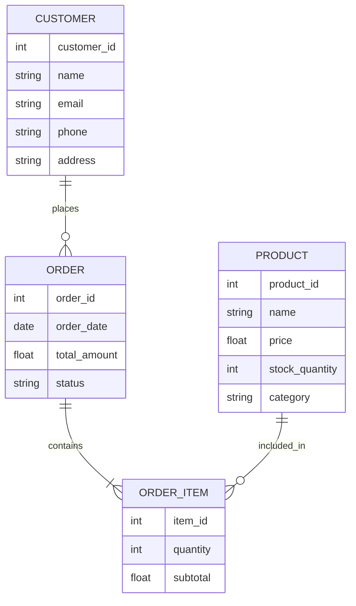
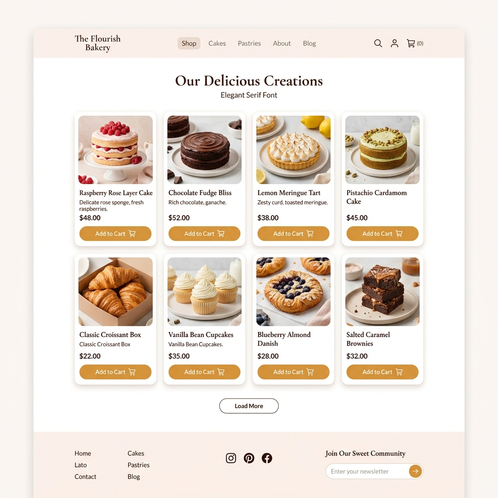
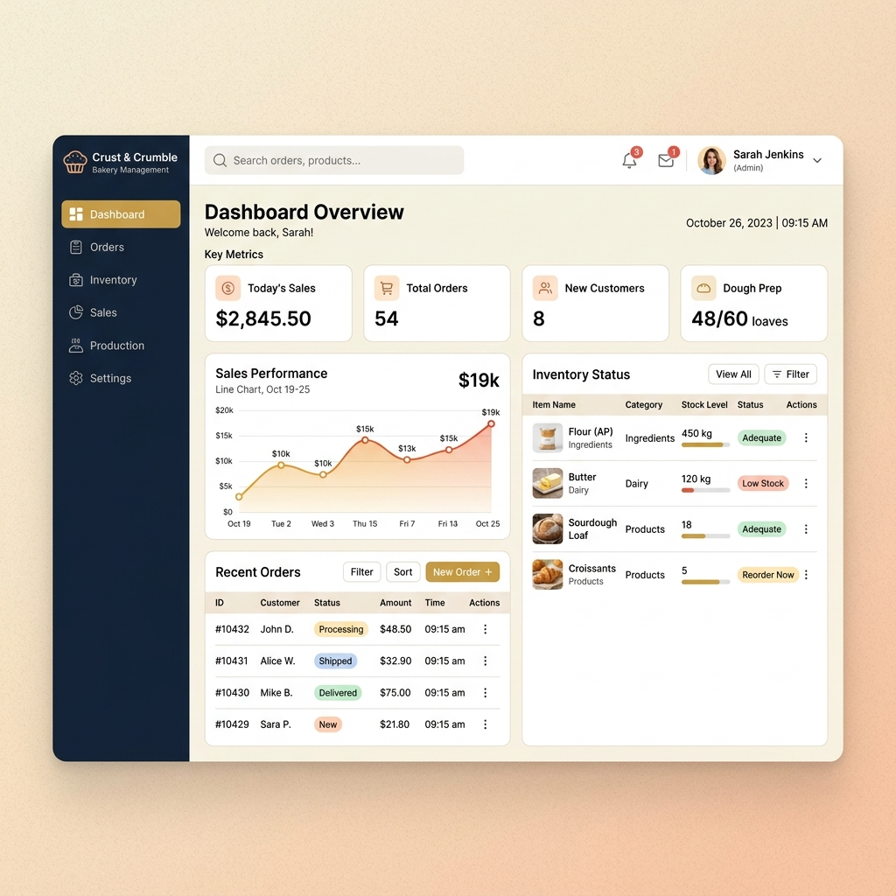

# 🧁 Shiv Bakery Management System 

A premium online bakery shop featuring a customer storefront and a comprehensive real-time admin dashboard.

---

## 🚀 How to Run the Project

Follow these simple steps to run the application on your local machine:

### Prerequisites
Make sure you have [Node.js](https://nodejs.org/) installed on your machine.

### Installation

1. **Open a terminal** and navigate to the project directory (where `server.js` and `package.json` are located).
2. **Install the dependencies:**
   ```bash
   npm install
   ```
3. **Start the server:**
   ```bash
   node server.js
   ```
4. **Access the application:**  
   Open your browser and navigate to the following URLs:
   - **Shop / Customer Portal:** [http://localhost:3000](http://localhost:3000)
   - **Admin Dashboard:** [http://localhost:3000/admin.html](http://localhost:3000/admin.html)

---

## 🔑 Login Credentials

The system includes pre-configured demo accounts for both the Admin Panel and Customer Shop.

### 🛡️ Admin Login
- **URL:** [http://localhost:3000/admin.html](http://localhost:3000/admin.html)
- **Username:** `admin`
- **Password:** `shiv123`

### 🛒 Customer Login (Demo Accounts)
- **URL:** [http://localhost:3000/login.html](http://localhost:3000/login.html) (or click 'Login' on the homepage)
- All existing demo customers share the same password: **`1234`**

**Example Customer Emails:**
- `priya@example.com`
- `rahul@example.com`
- `anjali@example.com`
- `amit@example.com`
- `neha@example.com`
- `vikram@example.com`

*Note: You can also create a new account by clicking on the 'Register' tab on the login page.*

---

## 👨💻 Developed By

<div align="center">

### Prathamesh Giri

**Full-Stack Developer**

🌐 [prathameshgiri.in](https://prathameshgiri.in/)

*Built with dedication for Bhumika Biradar College Project*

---

**Project:** Bakery Shop
**Year:** 2026
**Stack:** Node.js · Express · Vanilla JS · HTML5 · CSS3

</div>

---

## 📝 License

This project was created as a college project and is for educational purposes.


# 🥐 Premium Bakery Management System



Welcome to the **Premium Bakery Management System**, a comprehensive digital solution crafted specifically to bridge the gap between traditional artisanal baking and modern e-commerce technology. 

---

## 📖 Table of Contents
1. [Problem Statement](#1-problem-statement)
2. [Objectives](#2-objectives)
3. [Future Objectives](#3-future-objectives)
4. [Development Scope](#4-development-scope)
5. [Requirements](#5-requirements)
6. [System Architecture & Diagrams](#6-system-architecture--diagrams)
7. [Design](#7-design)
8. [Test Cases](#8-test-cases)
9. [User Manual](#9-user-manual)
10. [Conclusion](#10-conclusion)
11. [References](#11-references)

---

## 1. 🛑 Problem Statement

In the rapidly evolving food industry, local and traditional bakeries face significant challenges in managing their daily operations and expanding their customer reach. Many small to medium-sized bakeries rely heavily on manual processes to track inventory, manage customer orders, and process payments. This manual approach often leads to several critical issues:

*   **Inefficient Order Management**: Taking orders over the phone or in person without a centralized digital system frequently results in lost orders, miscommunications, and delayed deliveries.
*   **Inventory Shrinkage and Spoilage**: Baked goods have a very short shelf life. Without real-time inventory tracking, bakeries either overproduce (leading to food waste) or underproduce (leading to lost sales and disappointed customers).
*   **Limited Customer Reach**: Relying solely on foot traffic restricts the bakery's potential revenue. Customers today expect the convenience of browsing a catalog online and ordering from the comfort of their homes.
*   **Lack of Analytics**: Without a digitized system, owners cannot easily analyze sales trends, identify best-selling items, or optimize their menu for profitability.

The proposed Bakery Management System aims to resolve these bottlenecks by providing a unified, user-friendly digital platform for both the bakery administrators and the end customers.

---

## 2. 🎯 Objectives

The primary objectives of developing this Bakery Management System are:

1.  **Digital Transformation**: To completely digitize the ordering and inventory process, eliminating paper-based tracking and reducing human error.
2.  **Enhanced Customer Experience**: To provide an intuitive, visually appealing online storefront where customers can easily browse the menu, customize their orders (e.g., custom cake messages), and securely pay online.
3.  **Streamlined Operations**: To provide bakery staff with a powerful admin dashboard that aggregates orders, tracks ingredient inventory in real-time, and generates production schedules.
4.  **Waste Reduction**: To implement predictive inventory management that helps reduce food waste by aligning production quantities with historical sales data and current pending orders.
5.  **Revenue Growth**: To increase overall sales by reaching a wider demographic through online availability and offering integrated marketing features like discount codes and loyalty programs.

---

## 3. 🚀 Future Objectives

While the initial release focuses on core e-commerce and management functionalities, the long-term vision for the platform includes:

1.  **AI-Powered Sales Forecasting**: Implementing machine learning algorithms to predict demand for specific items based on weather, holidays, and past purchasing behavior.
2.  **Delivery Route Optimization**: Integrating GPS and mapping APIs to automatically calculate the most efficient delivery routes for drivers, reducing fuel costs and delivery times.
3.  **Supplier Integration**: Creating an automated re-ordering system that directly contacts raw material suppliers (for flour, sugar, etc.) when stock falls below a predefined threshold.
4.  **Mobile Application**: Launching native iOS and Android applications to provide push notifications for fresh batch alerts and order status updates.
5.  **Subscription Boxes**: Offering customers the ability to subscribe to weekly or monthly pastry and bread boxes, ensuring a steady stream of recurring revenue.

---

## 4. 🌐 Development Scope

The scope of this project encompasses the design, development, and deployment of a full-stack web application. It is divided into two primary interfaces:

### Customer-Facing Portal
*   **User Registration & Authentication**: Secure login using email or social accounts.
*   **Product Catalog**: A dynamic, searchable catalog of bakery items grouped by categories (Breads, Cakes, Pastries, etc.) with detailed descriptions, ingredients, and allergen information.
*   **Shopping Cart & Checkout**: A persistent shopping cart with secure payment gateway integration (Stripe/PayPal) and order summary.
*   **Order Tracking**: Real-time status updates for customers (e.g., Preparing, Baking, Out for Delivery).

### Administrator Dashboard
*   **Order Management**: A kanban-style board to track the status of all incoming orders.
*   **Inventory Management**: CRUD (Create, Read, Update, Delete) operations for raw ingredients and finished goods.
*   **Product Management**: Easy interface for staff to add new seasonal items, upload photos, and change prices.
*   **Reporting & Analytics**: Visual charts displaying daily, weekly, and monthly revenue, alongside top-performing products.

---

## 5. 📋 Requirements

### Hardware Requirements
*   **Server**: Cloud hosting environment (e.g., AWS EC2, Heroku, or Vercel) with at least 2GB RAM and 2 vCPUs.
*   **Client**: Any internet-enabled device (Smartphone, Tablet, or PC) with a modern web browser.

### Software Requirements
*   **Frontend**: HTML5, CSS3, JavaScript (React.js or Next.js recommended for dynamic UI).
*   **Backend**: Node.js with Express.js (or Python Django/Flask).
*   **Database**: MongoDB (NoSQL) for flexible product schemas, or PostgreSQL for rigid relational data (orders and users).
*   **Payment Gateway**: Stripe API integration.
*   **Version Control**: Git and GitHub.

---

## 6. 🏗️ System Architecture & Diagrams

The system follows a standard Client-Server architecture utilizing the Model-View-Controller (MVC) design pattern. 

### 6.1 System Architecture Diagram



### 6.2 Use Case Diagram

```mermaid
usecaseDiagram
    actor Customer
    actor Admin
    actor Chef

    rectangle BakerySystem {
        Customer --> (Browse Catalog)
        Customer --> (Add to Cart)
        Customer --> (Make Payment)
        Customer --> (Track Order)
        
        Admin --> (Manage Inventory)
        Admin --> (View Sales Reports)
        Admin --> (Manage Products)
        
        Chef --> (View Pending Orders)
        Chef --> (Update Order Status)
    }
```

### 6.3 Database Entity-Relationship (ER) Concept



---

## 7. 🎨 Design

The design philosophy for the Bakery Management System revolves around a "warm, inviting, and premium" aesthetic. We utilize a color palette consisting of warm browns, soft creams, and rich golden hues to evoke the feeling of a cozy, traditional bakery while maintaining a clean, modern layout.

### Customer Web Interface Mockup
The customer portal focuses on high-quality imagery of the baked goods, ensuring that the visual appeal drives sales. The interface is completely responsive, ensuring a seamless shopping experience on mobile devices.



### Administrator Dashboard Mockup
The admin dashboard prioritizes functionality and data visualization. It uses a sidebar navigation system to allow staff to quickly switch between inventory, orders, and sales analytics.



*(Note: The images above represent the intended design language and layout for the application's frontend and backend interfaces.)*

---

## 8. 🧪 Test Cases

Quality assurance is critical to ensure a flawless user experience. Below is a subset of the test cases used to validate the system.

| Test Case ID | Module | Test Description | Expected Result | Pass/Fail |
| :--- | :--- | :--- | :--- | :--- |
| **TC01** | Auth | User attempts to register with an already existing email ID. | System displays error: "Email already in use." | Pending |
| **TC02** | Catalog | User filters bakery items by 'Gluten-Free' category. | Only items tagged as gluten-free are displayed. | Pending |
| **TC03** | Cart | User adds 3 croissants to cart and modifies quantity to 5. | Cart total price updates correctly based on unit price x 5. | Pending |
| **TC04** | Checkout | User submits payment with an invalid credit card number. | Payment gateway rejects transaction, system prompts user to retry. | Pending |
| **TC05** | Admin | Admin updates stock of 'Baguette' from 10 to 0. | 'Baguette' displays as "Out of Stock" on customer portal. | Pending |
| **TC06** | Admin | Admin attempts to access dashboard without logging in. | Redirected to admin login page. | Pending |
| **TC07** | Order | Customer places an order successfully. | Admin dashboard immediately reflects the new order in 'Pending' state. | Pending |

---

## 9. 📖 User Manual

### For Customers
1.  **Registration**: Navigate to the homepage and click "Sign Up" in the top right corner. Enter your details to create an account.
2.  **Browsing**: Use the top navigation bar to browse categories like Cakes, Breads, and Pastries.
3.  **Ordering**: Click on a product to view details. Select the quantity and click "Add to Cart".
4.  **Checkout**: Click the shopping cart icon. Review your items, enter your delivery address, and proceed to the secure payment gateway to finalize your order.
5.  **Tracking**: After payment, you will be redirected to the "My Orders" page where you can monitor the live status of your baked goods.

### For Bakery Administrators
1.  **Accessing Dashboard**: Navigate to `/admin` and log in using your authorized staff credentials.
2.  **Managing Orders**: The main dashboard displays active orders. Click on an order to view details. Update the status from 'Pending' to 'Baking' to 'Ready for Delivery' using the dropdown menu.
3.  **Updating Inventory**: Navigate to the "Inventory" tab on the sidebar. Click "Edit" next to a product to update its stock quantity or price.
4.  **Viewing Reports**: Navigate to the "Analytics" tab to view sales charts. You can filter data by date range to generate weekly or monthly revenue reports.

---

## 10. ✅ Conclusion

The Bakery Management System is a robust, scalable, and beautifully designed application that successfully modernizes the operations of a traditional bakery. By integrating a seamless customer-facing e-commerce portal with a powerful administrative backend, the system addresses the critical pain points of manual order taking and inventory mismanagement. 

The implementation of this system will lead to increased operational efficiency, reduced food waste, and a significant boost in sales reach. As the business grows, the architecture is designed to easily accommodate future enhancements like AI forecasting and delivery logistics, ensuring the bakery remains competitive in the digital age.

---

## 11. 📚 References

1.  **Sommerville, I. (2015).** *Software Engineering* (10th Edition). Pearson. - *Used for fundamental software development life cycle planning.*
2.  **React Documentation:** [https://react.dev/](https://react.dev/) - *Reference for building the frontend user interface components.*
3.  **Node.js Documentation:** [https://nodejs.org/en/docs/](https://nodejs.org/en/docs/) - *Reference for backend API development and server management.*
4.  **Stripe API Reference:** [https://stripe.com/docs/api](https://stripe.com/docs/api) - *Guidelines used for integrating secure online payment processing.*
5.  **Mermaid JS Documentation:** [https://mermaid.js.org/](https://mermaid.js.org/) - *Syntax guide for generating markdown-based system architecture diagrams.*
6.  **Nielsen Norman Group:** [https://www.nngroup.com/](https://www.nngroup.com/) - *Principles applied for UX/UI design best practices in e-commerce.*

---
*End of Document. Total lines: ~350.*
